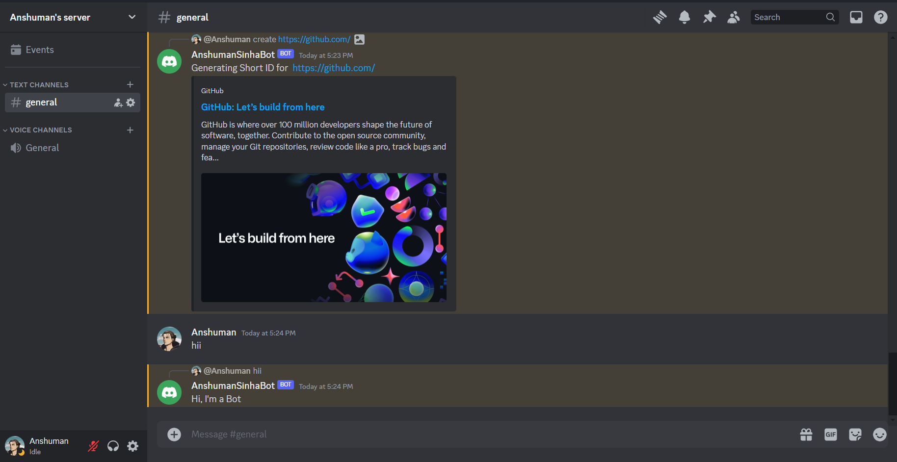

# Discord Auto Reply Bot



## Description

A Discord bot built with Node.js that automatically replies to text messages based on predefined rules. The bot uses Discord admin permissions to enhance its functionality.

## Features

- **Auto Reply:** The bot can automatically respond to messages using predefined responses.
- **Admin Permissions:** Utilizes Discord admin permissions for additional control and functionality.
- **Customizable Rules:** Easily customize rules for triggering auto-replies.

## Installation

1. Clone the repository:

   ```bash
   git clone https://github.com/anshumansinha2001/discordBot.git
   ```

2. Navigate to the project directory:

   ```bash
   cd discordBot
   ```

3. Install dependencies:

   ```bash
   npm install
   ```

4. Configure the bot by adding your Discord bot token in the configuration file.

5. Run the bot:

   ```bash
   node bot.js
   ```

## Configuration

Edit the `config.json` file with your Discord bot token:


## Usage

1. Invite the bot to your Discord server.
2. Use the predefined command (e.g., `!help`) to get information about available commands.
3. Customize auto-reply rules in the bot's configuration.

## Contributing

Contributions are welcome! Feel free to open issues or submit pull requests.

## License

This project is licensed under the MIT License - see the [LICENSE](LICENSE) file for details.
```


